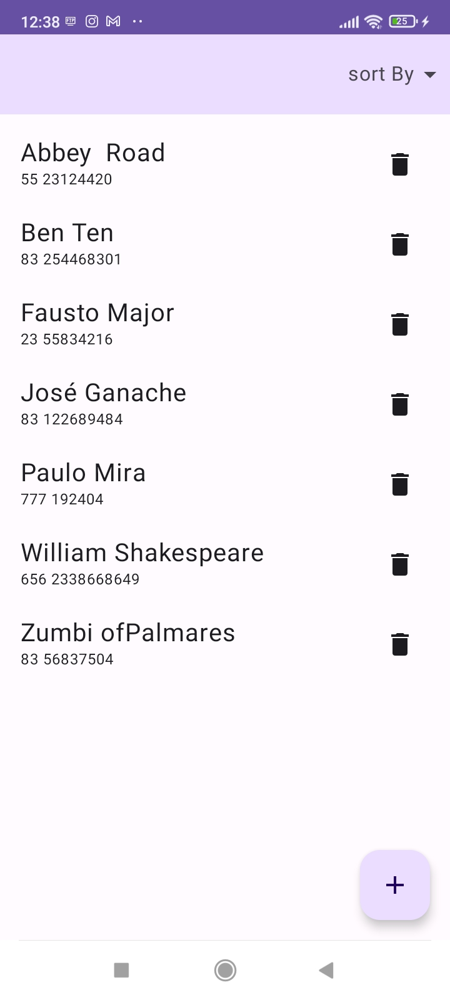
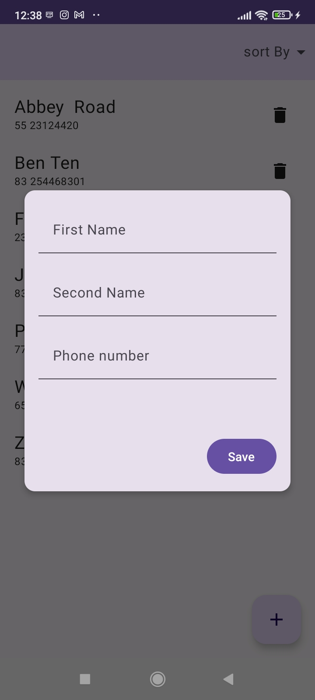
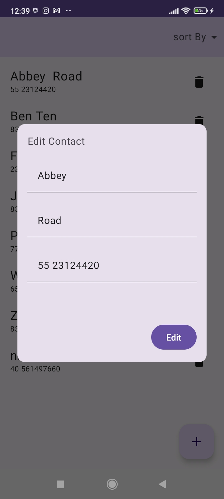

This is a Contact List app based on [Philipp Lackner's tutorial](https://www.youtube.com/watch?v=bOd3wO0uFr8).
The goal of this project was learn and pratice the use of Room on android development on building persistence databases. The app can do all the CRUD operations and users can order the contact list based on the first name, second name or phone number.  

## What i have done:
- Built a GUI
- Modeled and built a datamodel, database and Database Acess Object (DAO)
- Programmed a viewModel

## Technologies used:
- JetPack Compose
- Room Api
- Kotlin

## Future Improvements
- Add cloud sync with firebase 🔥
- Dependency injection

## ScreenShots

